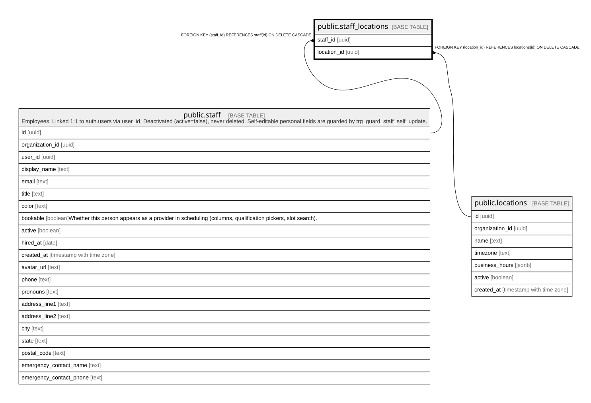

# public.staff_locations

## Columns

| Name        | Type | Default | Nullable | Children | Parents                                 | Comment |
| ----------- | ---- | ------- | -------- | -------- | --------------------------------------- | ------- |
| staff_id    | uuid |         | false    |          | [public.staff](public.staff.md)         |         |
| location_id | uuid |         | false    |          | [public.locations](public.locations.md) |         |

## Constraints

| Name                             | Type        | Definition                                                           |
| -------------------------------- | ----------- | -------------------------------------------------------------------- |
| staff_locations_location_id_fkey | FOREIGN KEY | FOREIGN KEY (location_id) REFERENCES locations(id) ON DELETE CASCADE |
| staff_locations_staff_id_fkey    | FOREIGN KEY | FOREIGN KEY (staff_id) REFERENCES staff(id) ON DELETE CASCADE        |
| staff_locations_pkey             | PRIMARY KEY | PRIMARY KEY (staff_id, location_id)                                  |

## Indexes

| Name                 | Definition                                                                                             |
| -------------------- | ------------------------------------------------------------------------------------------------------ |
| staff_locations_pkey | CREATE UNIQUE INDEX staff_locations_pkey ON public.staff_locations USING btree (staff_id, location_id) |

## Relations

---

> Generated by [tbls](https://github.com/k1LoW/tbls)
