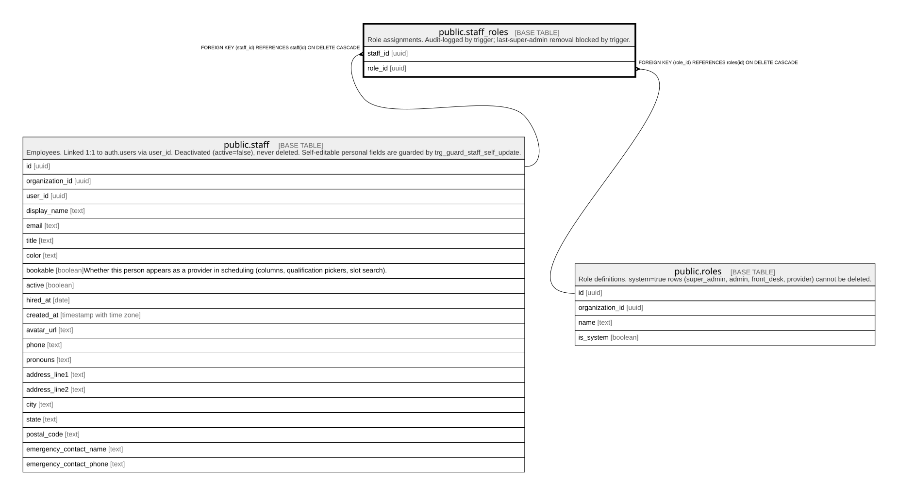

# public.staff_roles

## Description

Role assignments. Audit-logged by trigger; last-super-admin removal blocked by trigger.

## Columns

| Name     | Type | Default | Nullable | Children | Parents                         | Comment |
| -------- | ---- | ------- | -------- | -------- | ------------------------------- | ------- |
| staff_id | uuid |         | false    |          | [public.staff](public.staff.md) |         |
| role_id  | uuid |         | false    |          | [public.roles](public.roles.md) |         |

## Constraints

| Name                      | Type        | Definition                                                    |
| ------------------------- | ----------- | ------------------------------------------------------------- |
| staff_roles_staff_id_fkey | FOREIGN KEY | FOREIGN KEY (staff_id) REFERENCES staff(id) ON DELETE CASCADE |
| staff_roles_role_id_fkey  | FOREIGN KEY | FOREIGN KEY (role_id) REFERENCES roles(id) ON DELETE CASCADE  |
| staff_roles_pkey          | PRIMARY KEY | PRIMARY KEY (staff_id, role_id)                               |

## Indexes

| Name             | Definition                                                                                 |
| ---------------- | ------------------------------------------------------------------------------------------ |
| staff_roles_pkey | CREATE UNIQUE INDEX staff_roles_pkey ON public.staff_roles USING btree (staff_id, role_id) |

## Triggers

| Name                  | Definition                                                                                                                                |
| --------------------- | ----------------------------------------------------------------------------------------------------------------------------------------- |
| trg_audit_staff_roles | CREATE TRIGGER trg_audit_staff_roles AFTER INSERT OR DELETE ON public.staff_roles FOR EACH ROW EXECUTE FUNCTION audit_staff_role_change() |
| trg_last_super_admin  | CREATE TRIGGER trg_last_super_admin BEFORE DELETE ON public.staff_roles FOR EACH ROW EXECUTE FUNCTION prevent_last_super_admin_removal()  |

## Relations

---

> Generated by [tbls](https://github.com/k1LoW/tbls)
