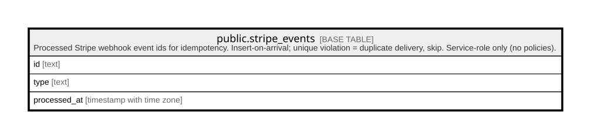

# public.stripe_events

## Description

Processed Stripe webhook event ids for idempotency. Insert-on-arrival; unique violation = duplicate delivery, skip. Service-role only (no policies).

## Columns

| Name         | Type                     | Default | Nullable | Children | Parents | Comment |
| ------------ | ------------------------ | ------- | -------- | -------- | ------- | ------- |
| id           | text                     |         | false    |          |         |         |
| type         | text                     |         | false    |          |         |         |
| processed_at | timestamp with time zone | now()   | false    |          |         |         |

## Constraints

| Name               | Type        | Definition       |
| ------------------ | ----------- | ---------------- |
| stripe_events_pkey | PRIMARY KEY | PRIMARY KEY (id) |

## Indexes

| Name               | Definition                                                                      |
| ------------------ | ------------------------------------------------------------------------------- |
| stripe_events_pkey | CREATE UNIQUE INDEX stripe_events_pkey ON public.stripe_events USING btree (id) |

## Relations

---

> Generated by [tbls](https://github.com/k1LoW/tbls)
