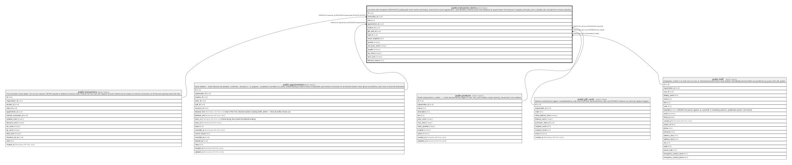

# public.transaction_items

## Description

Line items with name/price SNAPSHOTS (catalog edits never rewrite sold history). kind=service carries appointment + staff attribution; kind=tip carries staff attribution for payroll reads; kind=discount is negative; kind=gift_card is a liability sale, excluded from revenue reporting.

## Columns

| Name             | Type    | Default           | Nullable | Children | Parents                                       | Comment |
| ---------------- | ------- | ----------------- | -------- | -------- | --------------------------------------------- | ------- |
| id               | uuid    | gen_random_uuid() | false    |          |                                               |         |
| transaction_id   | uuid    |                   | false    |          | [public.transactions](public.transactions.md) |         |
| kind             | text    |                   | false    |          |                                               |         |
| appointment_id   | uuid    |                   | true     |          | [public.appointments](public.appointments.md) |         |
| product_id       | uuid    |                   | true     |          | [public.products](public.products.md)         |         |
| gift_card_id     | uuid    |                   | true     |          | [public.gift_cards](public.gift_cards.md)     |         |
| staff_id         | uuid    |                   | true     |          | [public.staff](public.staff.md)               |         |
| name_snapshot    | text    |                   | false    |          |                                               |         |
| quantity         | integer | 1                 | false    |          |                                               |         |
| unit_price_cents | integer |                   | false    |          |                                               |         |
| taxable          | boolean | false             | false    |          |                                               |         |
| tax_cents        | integer | 0                 | false    |          |                                               |         |
| total_cents      | integer |                   | false    |          |                                               |         |
| discount_reason  | text    |                   | true     |          |                                               |         |

## Constraints

| Name                                  | Type        | Definition                                                                                                       |
| ------------------------------------- | ----------- | ---------------------------------------------------------------------------------------------------------------- |
| transaction_items_kind_check          | CHECK       | CHECK ((kind = ANY (ARRAY['service'::text, 'product'::text, 'gift_card'::text, 'tip'::text, 'discount'::text]))) |
| transaction_items_quantity_check      | CHECK       | CHECK ((quantity > 0))                                                                                           |
| transaction_items_staff_id_fkey       | FOREIGN KEY | FOREIGN KEY (staff_id) REFERENCES staff(id)                                                                      |
| transaction_items_appointment_id_fkey | FOREIGN KEY | FOREIGN KEY (appointment_id) REFERENCES appointments(id)                                                         |
| transaction_items_product_id_fkey     | FOREIGN KEY | FOREIGN KEY (product_id) REFERENCES products(id)                                                                 |
| transaction_items_gift_card_id_fkey   | FOREIGN KEY | FOREIGN KEY (gift_card_id) REFERENCES gift_cards(id)                                                             |
| transaction_items_transaction_id_fkey | FOREIGN KEY | FOREIGN KEY (transaction_id) REFERENCES transactions(id) ON DELETE RESTRICT                                      |
| transaction_items_pkey                | PRIMARY KEY | PRIMARY KEY (id)                                                                                                 |

## Indexes

| Name                    | Definition                                                                                                           |
| ----------------------- | -------------------------------------------------------------------------------------------------------------------- |
| transaction_items_pkey  | CREATE UNIQUE INDEX transaction_items_pkey ON public.transaction_items USING btree (id)                              |
| transaction_items_txn   | CREATE INDEX transaction_items_txn ON public.transaction_items USING btree (transaction_id)                          |
| transaction_items_staff | CREATE INDEX transaction_items_staff ON public.transaction_items USING btree (staff_id) WHERE (staff_id IS NOT NULL) |

## Triggers

| Name             | Definition                                                                                                                  |
| ---------------- | --------------------------------------------------------------------------------------------------------------------------- |
| trg_product_sale | CREATE TRIGGER trg_product_sale AFTER INSERT ON public.transaction_items FOR EACH ROW EXECUTE FUNCTION apply_product_sale() |

## Relations

---

> Generated by [tbls](https://github.com/k1LoW/tbls)
