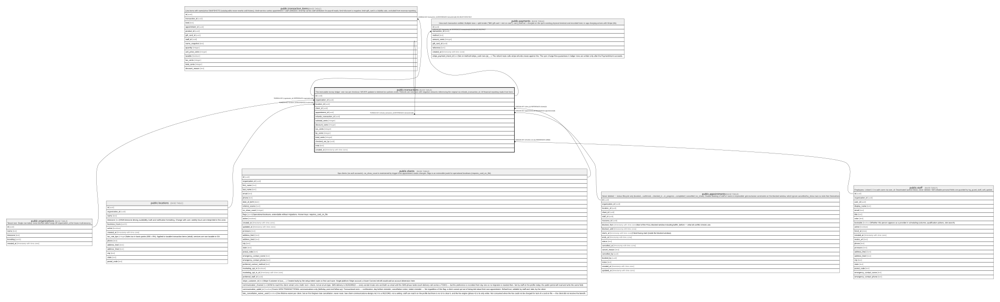

# public.transactions

## Description

The immutable money ledger: one row per checkout. NEVER updated or deleted (no policies exist). Refunds are new rows with negative amounts referencing the original via refunds_transaction_id. All financial reporting reads from here.

## Columns

| Name                   | Type                     | Default           | Nullable | Children                                                                                                                                    | Parents                                         | Comment |
| ---------------------- | ------------------------ | ----------------- | -------- | ------------------------------------------------------------------------------------------------------------------------------------------- | ----------------------------------------------- | ------- |
| id                     | uuid                     | gen_random_uuid() | false    | [public.transactions](public.transactions.md) [public.transaction_items](public.transaction_items.md) [public.payments](public.payments.md) |                                                 |         |
| organization_id        | uuid                     |                   | false    |                                                                                                                                             | [public.organizations](public.organizations.md) |         |
| location_id            | uuid                     |                   | false    |                                                                                                                                             | [public.locations](public.locations.md)         |         |
| client_id              | uuid                     |                   | true     |                                                                                                                                             | [public.clients](public.clients.md)             |         |
| appointment_id         | uuid                     |                   | true     |                                                                                                                                             | [public.appointments](public.appointments.md)   |         |
| refunds_transaction_id | uuid                     |                   | true     |                                                                                                                                             | [public.transactions](public.transactions.md)   |         |
| subtotal_cents         | integer                  |                   | false    |                                                                                                                                             |                                                 |         |
| discount_cents         | integer                  | 0                 | false    |                                                                                                                                             |                                                 |         |
| tax_cents              | integer                  | 0                 | false    |                                                                                                                                             |                                                 |         |
| tip_cents              | integer                  | 0                 | false    |                                                                                                                                             |                                                 |         |
| total_cents            | integer                  |                   | false    |                                                                                                                                             |                                                 |         |
| checked_out_by         | uuid                     |                   | false    |                                                                                                                                             | [public.staff](public.staff.md)                 |         |
| note                   | text                     |                   | true     |                                                                                                                                             |                                                 |         |
| created_at             | timestamp with time zone | now()             | false    |                                                                                                                                             |                                                 |         |

## Constraints

| Name                                     | Type        | Definition                                                                            |
| ---------------------------------------- | ----------- | ------------------------------------------------------------------------------------- |
| transactions_check                       | CHECK       | CHECK ((total_cents = (((subtotal_cents - discount_cents) + tax_cents) + tip_cents))) |
| transactions_organization_id_fkey        | FOREIGN KEY | FOREIGN KEY (organization_id) REFERENCES organizations(id)                            |
| transactions_location_id_fkey            | FOREIGN KEY | FOREIGN KEY (location_id) REFERENCES locations(id)                                    |
| transactions_checked_out_by_fkey         | FOREIGN KEY | FOREIGN KEY (checked_out_by) REFERENCES staff(id)                                     |
| transactions_client_id_fkey              | FOREIGN KEY | FOREIGN KEY (client_id) REFERENCES clients(id)                                        |
| transactions_appointment_id_fkey         | FOREIGN KEY | FOREIGN KEY (appointment_id) REFERENCES appointments(id)                              |
| transactions_pkey                        | PRIMARY KEY | PRIMARY KEY (id)                                                                      |
| transactions_refunds_transaction_id_fkey | FOREIGN KEY | FOREIGN KEY (refunds_transaction_id) REFERENCES transactions(id)                      |

## Indexes

| Name                 | Definition                                                                                              |
| -------------------- | ------------------------------------------------------------------------------------------------------- |
| transactions_pkey    | CREATE UNIQUE INDEX transactions_pkey ON public.transactions USING btree (id)                           |
| transactions_org_day | CREATE INDEX transactions_org_day ON public.transactions USING btree (organization_id, created_at DESC) |
| transactions_client  | CREATE INDEX transactions_client ON public.transactions USING btree (client_id, created_at DESC)        |

## Relations

---

> Generated by [tbls](https://github.com/k1LoW/tbls)
